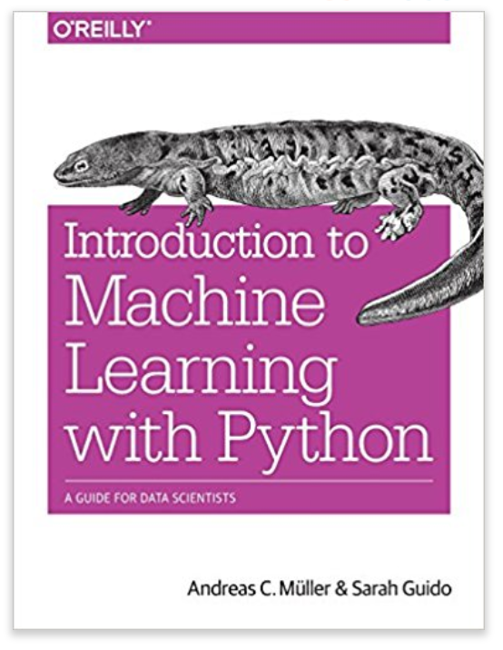

<a style="width: 200px" href="https://www.amazon.com/Introduction-Machine-Learning-Python-Scientists/dp/1449369413"></a>

Code examples from:
# Introduction to Machine Learning with Python
[Buy here](https://www.amazon.com/Introduction-Machine-Learning-Python-Scientists/dp/1449369413)

## Table of Contents

1. [Chapter 1](#chapter-1)&nbsp; Introduction
2. [Chapter 2](#chapter-2)&nbsp; Supervised Learning
3. [Chapter 3](#chapter-3)&nbsp; Unsupervised Learning
4. [Chapter 4](#chapter-4)&nbsp; Representing Data and Engineering Features
5. [Chapter 5](#chapter-5)&nbsp; Model Evaluation and Improvement
6. [Chapter 6](#chapter-6)&nbsp; Algorithm Chains and Pipelines
7. [Chapter 7](#chapter-7)&nbsp; Working with Text Data
8. [Chapter 8](#chapter-8)&nbsp; Wrapping Up

---

## Chapter 1
### Introduction

The code examples from the first chapter are split into `irises.py` and `libs.py`.

The latter, `libs.py`, just has some examples of methods and instances of classes
from the libraries the rest of the code will use (like numpy). `irises.py` contains
and implementation of the first model the book covers, the k-Nearest Neighbor
classifier.

---

## Chapter 2
### Supervised Learning

This chapter covers multiple supervised learning algorithms. Supervised learning
is done when you fit a predictive model with training data where the outcome
is already measured. These models are then evaluated by their ability to generalize,
or accurately predict test data it has not seen during the fitting process.

The `.py` files are broken down by model type (for the most part). Below
is a table of content with links to each algorithm covered by the code.

1. [k-Nearest Neighbors](#k-nearest-neighbors)
2. [Linear Regression](#linear-regression)
3. [Ridge Regression](#ridge-regression)
4. [Lasso Regression](#lasso-regression)
4. [LogisticRegression](#logistic-regression)
5. [Naive Bayes Classifiers](#naive-bayes-classifiers)
6. [Decision Trees](#decision-trees)
7. [Kernelized Support Vector Machines](#kernelized-support-vector-machines)
8. [Neural Networks](#neural-networks)
9. [Predicting Uncertainty](#predicting-uncertainty)

#### k-Nearest Neighbors

k-Nearest Neighbors is the simplest supervised classifiers
covered in this repository. It classifies new data by finding the
k closest known data points to the new one and classifying the
new data as the class of the majority.

The k-Nearest Neighbors Regressor is a regression algorithm which
linearly interpolates the output of a new set of input features
from the k closest known data points.

The parameters covered in this repo are:

- `n_neighbors` The number of neighbors taken into consideration.

kNN is a good model for small datasets and sets a good baseline. It is
also very easy to explain this model to a layman.

#### Linear Regression

Linear regression is a well-known algorithm which tries to find
a best fit linear relationship between known data's features and
its ouput.

#### Ridge Regression

Ridge regression is a form of linear regression which dampens
the impact of features whose coefficients in linear regression
are far from 0. This is done to prevent _over-fitting_, training
your model to make predictions too close to the training data
in order to generalize to new data.

The parameters covered in this repo are:

- `alpha` The regularization constant, a higher `alpha` means more regularization, when `alpha` is 0, ridge regression becomes normal linear regression.

#### Lasso Regression

Lasso regression is also linear regression with regularization. The difference
is that lasso regression uses the sum of each feature vector's components
whereas linear regression uses the sum of the components' squares.

The parameters covered in this repo are:

- `alpha` The regularization constant, a higher `alpha` means more regularization, when `alpha` is 0, lasso regression becomes normal linear regression.

#### Logistic Regression

Logistic regression is a classifier algorithm which uses regularized linear
regression. For two-class decisions, it uses the sign of the output of linear
regression to make its decisions. For multi-class, it compares each individual
class to every other one as if it were making a two-class decision, then picks
the class with the best fit.

The parameters covered in this repo are:

- `C` The regularization constant, as `C` increases the regularization decreases
- `penalty` What type of penalty to use for regularization. The default is to use
the Euclidean metric (ridge regression). The code also has an example of using the
L1 metric (lasso regression).

Linear models are a good first algorithm to try for very large datasets where
the feature vector has a very high dimension.

#### Naive Bayes Classifiers

This repo has 3 examples of naive bayes classifiers:

1. **BernoulliNB:** This classifier works on data where the feature set is a vector with binary values (0 or 1).

2. **MultinomialNB:** This classifier works on data where the feature set is a vector of discrete values (integers).

3. **GaussianNB:** This classifier works on data where the feature set is a real-valued vector.

Naive Bayes Classifiers are good for classification only, and are much faster than linear models.
Though the trade-off is that they tend to be less accurate.

#### Decision Trees

Decision trees are a type of classifier which classifies data using a series
of conditionals. It can be fit to training data perfectly, but in this case
is unable to generalize (a severe case of over-fitting).

One way to improve the generalization performance is to set a max depth for
the tree. This is called _pruning_ the tree.

Decision trees can be used for regression as well and can fit training data
perfectly at the expense of losing the ability to generalize.

Parameters covered in this repo are:

- `max_depth` which controls the maximum depth of the decision tree

Another way to increase the generalization performance is to use multiple
decision trees in one classifier. One way to do this is with the
`RandomForestClassifier` which creates a number of decision trees
and then classifies new data probabilistically.

Parameters for `RandomForestClassifier` covered in this repo are:

- `n_estimators` which controls the number of decision trees trained in the ensemble.

Gradient boosted decision trees are an ensemble which learn from each previous
tree. These trees can generalize very well without any parameter tuning. They usually
do require some tuning, though once trained they can be more accurate and less
memory intensive than random forests.

The parameters covered in this repo are:

- `max_depth` which controls the maximum depth of the decision tree
- `learning_rate` which controls how much influence each tree has, the smaller
the `learning_rate`, the less influence each previous iteration has on the ensemble.

#### Kernelized Support Vector Machines

Kernelized SVM's are a supervised learning algorithm which use linear
regression as well as non-linear terms to generalize to new data.

The parameters covered are:

- `gamma` Higher values of `gamma` mean less points can influence the decision
- `C` Higher values of `C` mean there will be less regularization

SVMs are good for medium-size datasets with features with similar meaning. They
do require you to scale your data and are sensitive to their tuning parameters.

#### Neural Networks

Neural networks are a famous classifying algorithm which work by
doing multiple layers of linear regression then applying a non-linear
activation function on each layer so that each level of regression
can introduce more non-linear terms to the decision boundary. Common
activation functions are `atan(x)` and `relu(x) = max(x, 0)`.

Neural networks allow for very non-linear decision boundaries with
very high accuracy. Though they are computationally expensive to train.

The parameters covered for neural networks are:

- `hidden_layers` a list of integers which determines how many hidden layers and how many hidden nodes the neural network will use.
- `alpha` a regularization constant for each step of linear regression

Neural networks take a long time to train, but can make very accurate decisions, particularly with large datasets.
They are sensitive to tuning parameteres and the data should be scaled.

#### Predicting Uncertainty

One way to measure the uncertainty of a classifier is
to use the `.predict_proba` method which shows how certain the classifier
is with its decision when classifying new data.

The `.decision_function` method takes input data and returns the
predictions for each point in the input.

---

## Chapter 3
### Unsupervised Learning

This chapter covers unsupervised learning algorithms, a class of
algorithms meant to run on data where there is no known output
and no training data to instruct the algorithm on what results
are correct. Rather these algorithms extract some knowledge
about the data or transform the data in a way which will help
a supervised algorithm.

The unsupervised learning algorithms in this repo are:

1. [Preprocessing and Scaling](#preprocessing-and-scaling)
2. [Principal Component Analysis](#principal-component-analysis)
3. [Non-negative Matrix Factorization](#non-negative-matrix-factorization)
4. [Manifold Learning](#manifold-learning)
5. [k-Means Clustering](#k-means-clustering)
6. [Agglomerative Clustering](#agglomerative-clustering)
7. [DBSCAN](#dbscan)
8. [Comparing Clustering Algorithms](#comparing-clustering-algorithms)

#### Preprocessing and Scaling

`sklearn` provides scaling transformers in the `sklearn.preprocessing`
module which can transform data before the data is used to train
a supervised model.

`MinMaxScaler` maps each feature to the interval [0, 1], where
the minimum value of that feature in the dataset and 1 is the
maximum.

A simplified implementation of the transformation done by `StandardScaler` is done
below:

```
min_on_training = X_train.min(axis=0)
range_on_training = (X_train - min_on_training).max(axis=0)
X_train_scaled = (X_train - min_on_training) / range_on_training
```

where `X_train` is the data used to train the transformer.

#### Principal Component Analysis

Principal Component Analysis (PCA) is a technique to reduce a high dimensional
dataset into a feature vector with a specified number of components.

As a preprocessing step, PCA can increase the accuracy of even simple
models noticeably.

It is usually hard to interpret the relationship between the original
features and the components.

The examples from this section in `pca.py` also are the first example
of using these techniques on image data.

#### Non-negative Matrix Factorization

Non-negative matrix factorization is similar to principal component analysis
except it does not work on negative-valued features.

`nmf.py` compares PCA with NMF. We also see that NMF is much better than
PCA at signal recovery.

#### Manifold Learning

Manifold learning (t-SNE) is another dimensionality reduction algorithm
which starts with a 2-dimensional representation of the data and tries
to emphasize relationships between neighboring points in the new
representation. This algorithm can find classifications in data
unsupervised, an example of t-SNE on handwritten digits in `tsne.py`.

Manifold learning is mainly used for exploratory analysis on training
data and is not used for preprocessing test data for generalization.

#### k-Means Clustering

k-Means Clustering classifies data by first computing _k_ mean
data points which minimize the distance between the computed
mean and the nearest neighbors.

k-Means Clustering is not good for complex data shapes, it
works best on well separated clusters that are simply shaped.

`kmeans.py` shows an example of how k-means clustering performs
on differently shaped datasets, including the face image data.

#### Agglomerative Clustering

Agglomerative clustering joins near neighbors until the
dataset is grouped into a specified number of clusters.

`aggomclustering.py` contains examples of agglomerative
clustering on datasets represented by scatter plots.

#### DBSCAN

DBSCAN is a clustering algorithm which can find how many
clusters are best for the dataset _a priori_. It starts
with finding data points that are close together and find
clusters based on how data is grouped together.

DBSCAN is a powerful clustering algorithm which can classify
even complex-shaped datasets. `dbscan.py` shows examples
of how it capable of properly clustering the two moons `sklearn`
dataset.

#### Comparing Clustering Algorithms

`compareclustering.py` shows how the different clustering
algorithms compare using a number of metrics:

- **Adjusted Random Index (ARI)** is a value in [0, 1] which gives a measure of how related the clusters are. Random classification will score a 0, in the example in the code, DBSCAN scores a 1.
- **Silhouette Score** is a metric of how close together the clusters are.

It also compares how the different algorithms cluster face image data.

----

## Chapter 4
### Representing Data and Engineering Features

This chapter is broken into the following sections, each covered with a separate
`.py` file. They are:

1. [Categorical Variables](#categorical-variables)
2. [Binning](#binning)
3. [Interactions and Polynomials](#interactions-and-polynomials)
4. [Univariate Nonlinear Transfromations](#univariate-nonlinear-transformations)
5. [Automatic Feature Selection](#automatic-feature-selection)
6. [Utilizing Expert Knowledge](#utilizing-expert-knowledge)

#### Categorical Variables

Categorical variables are variables which can be only a discrete set of values,
in opposition to continuous variables, which can be a range of real-valued
numbers.

Categorical variables are usually stored as enumerable string variables in the
data. `pandas` provides a way to convert string-valued features into integer
values using `pd.get_dummies` before training a model.

One can also typecast any numerical features to string and have them treated
as categorical variables as well. This works under the assumption the numerical-valued
feature can only be a discrete number of values.

One can see examples of how to treat categorical variables in `categoricalvars.py`.

#### Binning

Given a real-valued input feature which can be a continuous
range of values, _binning_ is a method of discretizing the continuous feature
into a discrete number of bins, or ranges of values.

Binning helps linear models perform slightly better, though it does
make decision trees perform worse.

`binning.py` contains an example of using `numpy` to bin a continuous input feature
and how it influences linear models' and decision trees' performance.

#### Interactions and Polynomials

`polynomials.py` shows an example of adding addition polynomial features to
a dataset to improve the performance of some linear models.

Polynomial features are usually existing numerical features which are
then multiplied and cross multiplied to construct polynomials.

It also shows that support vector machines predict the original feature
set with a higher accuracy than `LinearRegression`. It also shows
how the `Ridge` regressor improves when using polynomial features.

#### Univariate Nonlinear Transformations

`nonlinear.py` has an example of how non-linear transformations,
in this case _log_, can improve model performance on certain
datasets.

#### Automatic Feature Selection

Automatic feature selection refers to the elimination of features based on
their relevance to the output of the data.

`autofeatureselection.py` covers 3 different methods of feature selection:

The first is with `SelectPercentile` which filters only the features
which are important for classification up to the selected percentile
of features. The importance is computed using univariate statistics.

The second is `SelectFromModel` which uses a selected model to determine how
important features are for classification, then filters the features accordingly.

The final one is Recursive Feature Elimination (`RFE`) recursively trains a
model and filters the least important ones over and over until it reduces
the feature set to a specified size. This method is more computationally
expensive than the other methods due to the need to train multiple models.

#### Utilizing Expert Knowledge

In `expertknowledge.py`, we see an example anaylsis on Citi Bike data to predict
the number of available bikes.

This section highlights how one can pick features that we know for subjective
reasons will be important for predictions, and using them to improve
model performance.

---

## Chapter 5
### Model Evaluation and Improvement

This chapter contains techniques for automating the process of tuning your
model parameters for your dataset. It also provides alternative metrics
besides just the R^2 score for measuring model performance.

The sections of this chapter are broken down into:

1. [Cross Validation](#cross-validation)
2. [Grid Search](#grid-search)
3. [Model Evaluation](#model-evaluation)
4. [Multiclass Metrics](#multiclass-metrics)
5. [Model Selection](#model-selection)

#### Cross Validation

Cross validation takes the training data and performs a second
train_test_split on the different parts of the training data, and
compares how models perform when trained and tested against those

`crossvalidation.py` shows an example of this analysis. It also
shows different methods of splitting the data such as `KFold` and
`LeaveOneOut`.

#### Grid Search

Grid Search is a method of tuning model parameters. You specify which parameter values
you want to test the accuracy with, and then you do a cross validation test on each
possible configuration that you supply.

`gridsearch.py` has an example of performing a grid search analysis to train a supervised
model. It also has an example of plotting the results of a 2D grid search as a heatmap
to better visualize the result.

Grid search is computationally expensive, since you have to train one model per possible
config per split in the cross-validation.

#### Model Evaluation

`modelevaluation.py` covers other metrics besides the R^2 score to evaluate the accuracy
of a model for binary classification. For some imbalanced datasets, accuracy can paint
a deceptive picture of how well a model performs compared to random guessing.

It introduces the _confusion matrix_ which shows the number of true negatives (TN),
false negatives (FN), true positives, and false positives (FP).

- Accuracy is given by: `(TP + TN) / (TP + TN + FP + FN)`
- Precision is given by: `TP / (TP + FP)`
- Recall is given by: `TP / (TP + FN)`

You can read more on what the latter 2 metrics mean [in this article](https://en.wikipedia.org/wiki/Sensitivity_and_specificity).

This code has an example of using the `classification_report` method in the
`sklearn.metrics` module which shows the accuracy, precision, recall, and F1
score of a classifier, where an F1 score, the _harmonic mean_ of the precision
and recall.

Another metric this section covers is the Receiver Operating Characteristics (ROC) curve
which plots the _true positive rate_ (TPR) as a function of the _false positive rate_ (FPR).

- False positive rate: `FP / (FP + TN)`
- True positive rate: `TP / (TP + FN)`

You may have noticed that TPR and recall are the same. A single number which one can gather
from the ROC curve is the area under the curve (AUC) which gives an idea how well the model
performed.

#### Multiclass Metrics

`multiclassmetrics.py` shows examples of the analysis on the performance of classification
models where the output can be more than 2 possible classes.

It shows an example of the confusion matrix of a multiclass problem and analyzing the
precision, recall, and F1 score of the model.

#### Model Selection

`modelselection.py` shows an example of using grid search with ROC AUC as the scoring
metric to select a model which classifies handwritten digits as 9's or any other digit
(an example of an imbalanced dataset). It also illustrates how accuracy is not a good
success metric for this particular problem.

Suggested reading on the topics covered in chapter 5:

- [Data Science for Business](https://www.amazon.com/Data-Science-Business-Data-Analytic-Thinking/dp/1449361323) by Provost and Fawcett

---

## Chapter 6
### Algorithm Chains and Pipelines

This chapter is broken into 3 separate sections covered by separate `.py` files.
They are listed below:

#### Parameter Selection

`paramselection.py` shows an example of how scaling the data before doing cross-validation
and how it can lead to errors in the analysis of a model. Since preprocessing transformations
are fit using the same data used for cross-validation, the metrics provided by a CV analysis
may not accurately reflect how a model processes new data.

#### Pipelines

`pipelines.py` provides a solution to this problem. Pipelines are an interface provided by
`sklearn` to chain together multiple steps in a model from proprocesing to making actual
predictions using a supervised model.

The program has examples of creating pipelines using the `Pipeline` interface's constructor
function or using the more concise `make_pipeline` function, both in the `sklearn.pipeline`
module.

#### Grid Search

`gridsearch.py` contains an example of doing a grid search analysis on an algorithm pipeline.
The program contains examples of tuning parameters at different steps in the pipeline.

---

## Chapter 7
### Working with Text Data

This chapter covers sentiment analysis on a dataset of IMDb movie reviews.
We look at 25,000 movie reviews and cover training a model to classify
if a movie review is positive or negative.

The chapter is broken down into separate programs into the following sections:

1. [Movie Reviews](#movie-reviews)
2. [Bag of Words](#bag-of-words)
3. [Tokenization](#tokenization)
4. [Latent Dirichlet Allocation](#latent-dirichlet-allocation)

#### Movie Reviews

`moviereviews.py` contains the bulk of the material from the first half of the chapter.

It provides an example of representing the feature set using the `CountVectorizer` class
in the `sklearn.feature_extraction.text` which constructs the _count vector_ of each review,
or a sparse matrix representation of the number of times a word appears in each review.
This count vector can be used to train a linear model to make predictions that are 88% accurate.

The count vector can set a `min_df` parameter to set the _minimum document frequency_ that each
word needs to have to be considered part of the input feature. Another method of increasing accuracy
is to exclude _stop words_, common English words that are not relevant to the overall meaning of the
review.

It also shows an example of using the `TfidfVectorizer`, a class exported by `sklearn.feature_extraction.text`
which creates term vectors where each component is the Term Frequency Inverse Document Frequency (tf-idf)
which is given by:

```
tfidf(w) = tf(w) * log((N + 1) / (N_w + 1)) + 1
```

where `tf` is the term frequency of the word in each review (how many times the word is in that
particular review), `N` is the documents in the dataset and `N_w` is number of documents with
the word `w`.

The program also does a grid search tuning the `ngram_range` which sets the maximum _n_-gram size
the model takes into consideration. A single word is a 1-gram, a combination of two words in the
order they appear in the document is a 2-gram, and so on.

#### Bag of Words

`bagofwords.py` is a supplemental program to `moviereviews.py`. It has examples of using the
`CountVectorizer` class and tuning the _n_-gram range.

#### Tokenization

`tokenization.py` contains examples of two different types of _tokenization_, or a method
of grouping together similar words based on their syntactical root or context in a sentence.

_Stemming_ is a form of tokenization where words are broken down into their syntatical stem. For example,
the word 'replace' might have the stem 'replac' and any form with this stem is recognized as an instance
of the same token. This is implemented in the program using the `nltk.stem.PorterStemmer` from the `nltk`
module.

_Lemmatization_ is another form of tokenization which also takes the word's context in the sentence
into consideration. It is implemented with the `spacy` module to determine the tokenization of the
document. We see that lemmatization can add a modest boost in performance when training our model.

#### Latent Dirichlet Allocation

Latent Dirichlet Allocation is a method of sorting text data by topic. LDA determines how to classify
the text data by topic. One can see what words belong to what topics and how many documents fit
into each topic. There are examples of this process in `latentdirichlet.py`.

---

## Chapter 8
### Wrapping Up

This final chapter wraps up the book, the only code for this chapter is a template for building
a custom estimator class, which is all in `estimator.py`.

Suggested Reading:

- ["Machine Learning: The High Interest Credit Card of Technical Debt"](https://ai.google/research/pubs/pub43146) by Google's machine learning research team.
- [Bandit Algorithms for Website Optimization](https://www.amazon.com/Bandit-Algorithms-Website-Optimization-Developing/dp/1449341330) by John Myles White
- [The Elements of Statistical Learning](https://www.amazon.com/gp/product/0387848576/ref=ox_sc_saved_title_1?smid=ATVPDKIKX0DER&psc=1) by Hastie, Tibshirani, and Friedman
- [Machine Learning: An Algorithmic Perspective](https://www.amazon.com/Machine-Learning-Algorithmic-Perspective-Recognition/dp/1420067184) by Stephen Marshland
- [Machine Learning: A Probabalistic Perspective](https://www.amazon.com/gp/product/0262018020/ref=ox_sc_saved_title_2?smid=ATVPDKIKX0DER&psc=1) by Stephen Marsland
- [Pattern Recognition and Machine Learning](https://www.amazon.com/gp/product/B07CMM4TWS/ref=dbs_a_def_rwt_hsch_vapi_tkin_p1_i0) by Christopher Bishop
- [Introduction to Information Retrieval](https://www.amazon.com/Introduction-Information-Retrieval-Christopher-Manning/dp/0521865719) by Manning, Raghavan, and Schutze
- [Deep Learning](https://www.amazon.com/gp/product/0262035618/ref=ox_sc_saved_title_5?smid=A10K3X0OCF2LSA&psc=1) by Goodfellow, Bengio, and Courville
